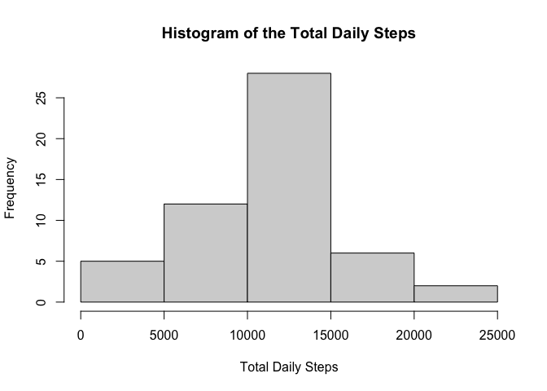
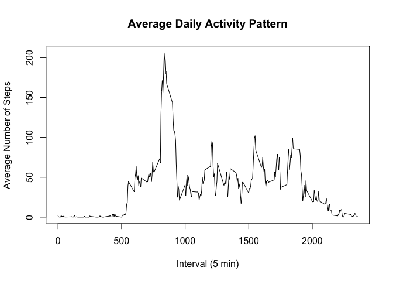
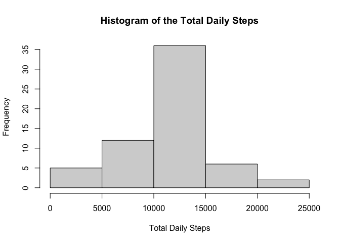
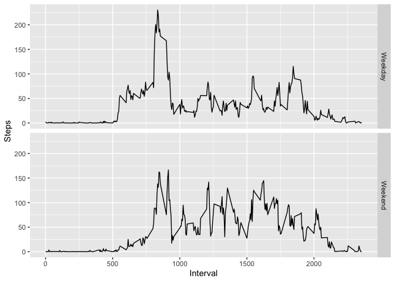

This project analyzes data from a personal activity monitoring device, which recorded the number of steps taken by an anonymous individual at 5-minute intervals from October to November 2012.

## Loading and preprocessing the data

I first downloaded the dataset, "activity.csv" and loaded it into R.

```r
data <- read.csv("activity.csv")
summary(data)
```

```
##      steps            date              interval     
##  Min.   :  0.00   Length:17568       Min.   :   0.0  
##  1st Qu.:  0.00   Class :character   1st Qu.: 588.8  
##  Median :  0.00   Mode  :character   Median :1177.5  
##  Mean   : 37.38                      Mean   :1177.5  
##  3rd Qu.: 12.00                      3rd Qu.:1766.2  
##  Max.   :806.00                      Max.   :2355.0  
##  NA's   :2304
```

The data has three variables:
* steps: Number of steps taking in a 5-minute interval (missing values are coded as \color{red}{\verb|NA|}NA)  
* date: The date on which the measurement was taken in YYYY-MM-DD format  
* interval: Identifier for the 5-minute interval in which measurement was taken  

The date variable is of the class "character", which needs to be converted into class "Date".

```r
data$date <- as.Date(data$date, "%Y-%m-%d")
summary(data)
```

```
##      steps             date               interval     
##  Min.   :  0.00   Min.   :2012-10-01   Min.   :   0.0  
##  1st Qu.:  0.00   1st Qu.:2012-10-16   1st Qu.: 588.8  
##  Median :  0.00   Median :2012-10-31   Median :1177.5  
##  Mean   : 37.38   Mean   :2012-10-31   Mean   :1177.5  
##  3rd Qu.: 12.00   3rd Qu.:2012-11-15   3rd Qu.:1766.2  
##  Max.   :806.00   Max.   :2012-11-30   Max.   :2355.0  
##  NA's   :2304
```
  
## What is mean total number of steps taken per day?

To examine the mean total number of steps taken per day, I calculated the total number of steps for each day and visualized the distribution using a histogram.

```r
totals <- with(data, tapply(steps, date, sum))
hist(totals,
     main = "Histogram of the Total Daily Steps", 
     xlab = "Total Daily Steps")
```

<!-- -->

The mean and median number of steps per day are given below.

```r
mean(totals, na.rm = TRUE)
```

```
## [1] 10766.19
```

```r
median(totals, na.rm = TRUE)
```

```
## [1] 10765
```
  
## What is the average daily activity pattern?

I calculated the mean number of steps for each 5-minute interval across the day and plotted the results to examine the average daily activity pattern.

```r
means <- with(data, tapply(steps, interval, mean, na.rm = TRUE))
plot(names(means), means, type = "l",
     main = "Average Daily Activity Pattern",
     xlab = "Interval (5 min)",
     ylab = "Average Number of Steps")
```

<!-- -->
  
Which 5-minute interval, on average across all the days in the dataset, contains the maximum number of steps?

```r
max.steps <- max(means)
max <- names(means)[means == max.steps]
```
Interval 835 contains the maximum number of steps on average, which can also be seen in the average daily activity pattern plot above.
  
## Imputing missing values

To impute missing values, I first counted the number of missing data.

```r
missing <- sum(is.na(data))
summary(data)
```

```
##      steps             date               interval     
##  Min.   :  0.00   Min.   :2012-10-01   Min.   :   0.0  
##  1st Qu.:  0.00   1st Qu.:2012-10-16   1st Qu.: 588.8  
##  Median :  0.00   Median :2012-10-31   Median :1177.5  
##  Mean   : 37.38   Mean   :2012-10-31   Mean   :1177.5  
##  3rd Qu.: 12.00   3rd Qu.:2012-11-15   3rd Qu.:1766.2  
##  Max.   :806.00   Max.   :2012-11-30   Max.   :2355.0  
##  NA's   :2304
```
There are 2304 missing values, which are all in the steps variable, as seen in the summary of the data.  

I imputed the missing value by replacing them with the average number of steps for the corresponding time interval.

```r
data.imput <- data 
for(i in 1:nrow(data.imput)) {
        data.imput[i, is.na(data.imput[i,])] <- means[names(means) == data.imput$interval[i]]
}
summary(data.imput)
```

```
##      steps             date               interval     
##  Min.   :  0.00   Min.   :2012-10-01   Min.   :   0.0  
##  1st Qu.:  0.00   1st Qu.:2012-10-16   1st Qu.: 588.8  
##  Median :  0.00   Median :2012-10-31   Median :1177.5  
##  Mean   : 37.38   Mean   :2012-10-31   Mean   :1177.5  
##  3rd Qu.: 27.00   3rd Qu.:2012-11-15   3rd Qu.:1766.2  
##  Max.   :806.00   Max.   :2012-11-30   Max.   :2355.0
```

With the missing values now estimated, I generated a histogram from the new mean total number of steps per day.

```r
totals.imput <- with(data.imput, tapply(steps, date, sum))
hist(totals.imput,
     main = "Histogram of the Total Daily Steps", 
     xlab = "Total Daily Steps")
```

<!-- -->

The new mean and median number of steps per day are given below. Only the median has shifted from the original calculated above without the NA values, while the mean has remained the same.

```r
mean(totals.imput, na.rm = TRUE)
```

```
## [1] 10766.19
```

```r
median(totals.imput, na.rm = TRUE)
```

```
## [1] 10766.19
```
  
## Are there differences in activity patterns between weekdays and weekends?

To examine the differences in activity between weekends and weekdays, a new factor variable was first created that divide the dataset into those two categories.

```r
weekdays <- c('Monday', 'Tuesday', 'Wednesday', 'Thursday', 'Friday')
data.imput$week <- factor((weekdays(data.imput$date) %in% weekdays), 
                   levels=c(FALSE, TRUE), labels=c('Weekend', 'Weekday')) 
```

I calculated the mean number of steps per interval separately for both weekends and weekdays.

```r
means.wknd <- with(data.imput[data.imput$week == "Weekend", ], tapply(steps, interval, mean))
means.wkdy <- with(data.imput[data.imput$week == "Weekday", ], tapply(steps, interval, mean))
```

For easy graphing, the calculated means were wrapped up into a new, tidy dataset using the `package dplyr`.

```r
library(dplyr)
```

```
## 
## Attaching package: 'dplyr'
```

```
## The following objects are masked from 'package:stats':
## 
##     filter, lag
```

```
## The following objects are masked from 'package:base':
## 
##     intersect, setdiff, setequal, union
```

```r
data.combined <- data.frame(c(means.wknd, means.wkdy))
data.combined <- mutate(data.combined,
                        Steps = data.combined[, 1],
                        Interval = rep(unique(data.imput$interval), 2),
                        Week = c(rep("Weekend", length(means.wknd)), rep("Weekday", length(means.wkdy))))
data.combined <- data.combined[, -1]
```

Finally, I generated a panel plot comparing the mean number of steps per interval between weekends and weekdays.

```r
library(ggplot2)
ggplot(data.combined, aes(Interval, Steps)) +
        geom_line() +
        facet_grid(Week ~ .)
```

<!-- -->
